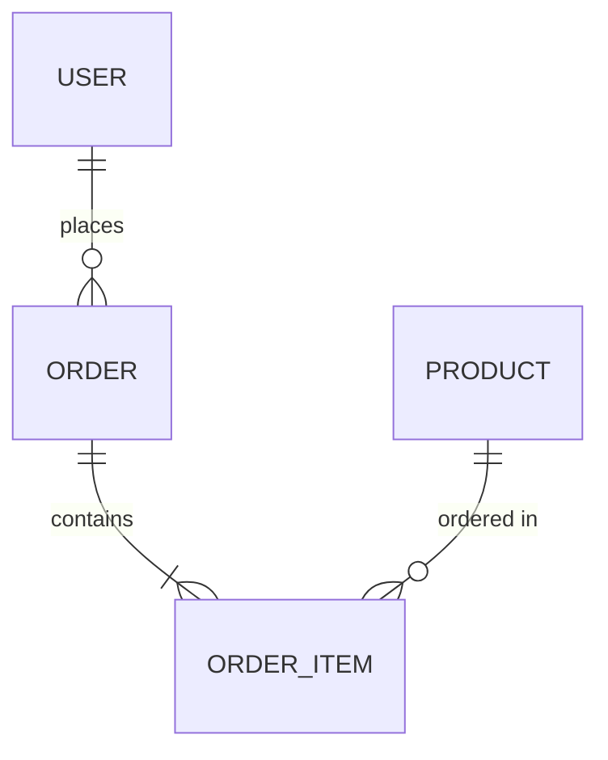

# 技术设计方案生成器

生成标准化、结构完整的技术设计方案文档，确保团队技术文档的一致性和完整性。

## 快速开始

生成一个完整的技术方案文档，包含以下标准章节：

1. **数据库设计** - 表清单、ER 图、建表 SQL、表关系说明
2. **架构设计** - 系统架构图、技术栈说明
3. **数据模型** - 实体关系、数据权限、多租户隔离
4. **接口设计** - Controller/Service/Mapper 接口规范
5. **核心业务流程** - 业务流程图和说明
6. **功能权限配置** - 权限规则和配置说明

## 文档结构

标准技术方案文档应包含以下章节（按顺序）：

```
# [功能名称] - 技术方案

## 1. 数据库设计
### 1.1 表清单
### 1.2 ER 图
### 1.3 表关系说明
### 1.4 建表 SQL

## 2. 架构设计
### 2.1 系统架构图
### 2.2 技术栈说明

## 3. 数据模型
### 3.1 表关系图
### 3.2 数据权限
### 3.3 多租户隔离
### 3.4 软删除

## 4. 组件接口设计
### 4.1 Controller 接口
### 4.2 Service 接口
### 4.3 Mapper 接口

## 5. 核心业务流程
### 5.1 [流程1名称]
### 5.2 [流程2名称]
### 5.3 [流程3名称]

## 6. 功能权限配置
```

## 使用流程

### 创建新技术方案

1. **确定功能范围** - 明确要设计的功能模块
2. **设计数据库** - 参考 [references/database-design.md](references/database-design.md)
3. **设计接口** - 参考 [references/api-design.md](references/api-design.md)
4. **设计业务流程** - 参考 [references/business-flow.md](references/business-flow.md)
5. **完善权限配置** - 定义数据权限和操作权限

### 规范化现有文档

1. **检查章节完整性** - 对照标准结构检查缺失章节
2. **统一格式** - 参考 [references/template-overview.md](references/template-overview.md)
3. **补充缺失内容** - 根据各 reference 文件补充标准内容

## 何时查看 Reference 文件

- **template-overview.md** - 需要了解完整文档结构和各章节作用时
- **database-design.md** - 设计数据库表结构、ER 图、SQL 时
- **api-design.md** - 设计 Controller/Service/Mapper 接口时
- **business-flow.md** - 绘制业务流程图、描述业务逻辑时

## 图表绘制

所有流程图和 ER 图使用 **Mermaid** 语法：

### ER 图示例



### 流程图示例


## 输出格式

生成的技术方案文档应：

1. **使用 Markdown 格式**
2. **标题层级清晰** - 使用 # ## ### 标记层级
3. **表格规范** - 使用 Markdown 表格语法
4. **代码块标注语言** - SQL 代码使用 ```sql，Java 代码使用 ```java
5. **图表使用 Mermaid** - 所有流程图和 ER 图使用 ```mermaid 代码块

## 质量检查清单

生成文档后，检查以下项目：

- [ ] 所有标准章节都已包含
- [ ] 表清单完整，包含序号、表名、说明
- [ ] ER 图使用 Mermaid 绘制
- [ ] 建表 SQL 完整可执行
- [ ] 接口设计包含请求/响应示例
- [ ] 业务流程图清晰易懂
- [ ] 权限配置说明完整

## 示例

参考各 reference 文件中的完整示例。
