# 业务流程设计规范

本文档定义业务流程的设计规范、流程图绘制方法和描述格式。

**重要：默认使用时序图（sequenceDiagram）** 来描述核心业务流程，清晰展示系统组件之间的交互和数据流转。

## 1. 业务流程章节结构

```markdown
## 5. 核心业务流程

### 5.1 [流程1名称]

#### 流程图

​```mermaid
sequenceDiagram
    participant A as 参与者A
    participant B as 参与者B
    participant C as 参与者C

    A->>B: 操作1
    B->>C: 操作2
    C-->>B: 返回结果
    B-->>A: 返回结果
​```

#### 流程说明

1. **步骤1**: 说明
2. **步骤2**: 说明
3. **步骤3**: 说明

#### 异常处理

- **异常1**: 处理方式
- **异常2**: 处理方式

### 5.2 [流程2名称]
...
```

## 2. 时序图（sequenceDiagram）- 主要格式

### 2.1 基本语法

时序图用于展示系统组件之间的交互顺序和消息传递，是描述业务流程的首选方式。

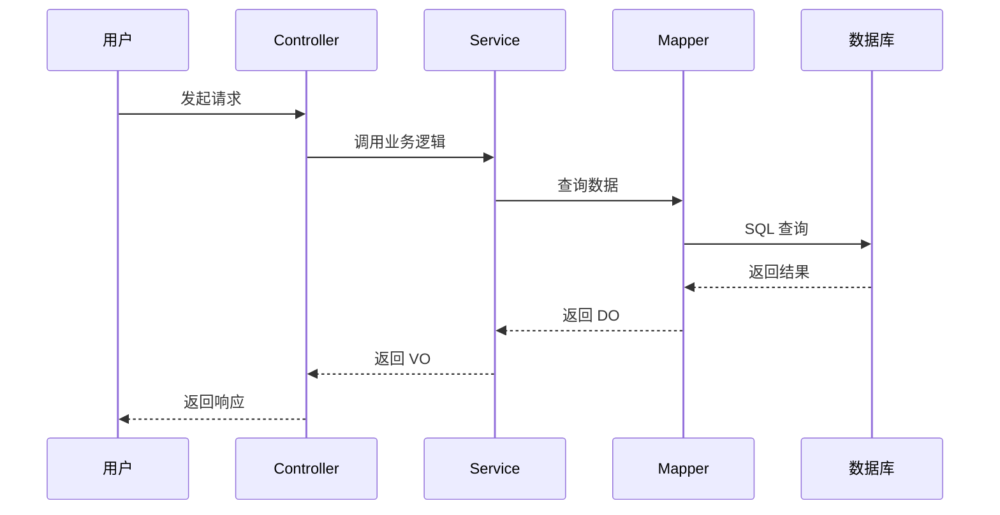

### 2.2 参与者定义

使用 `participant` 定义参与者，可以使用别名简化图表：

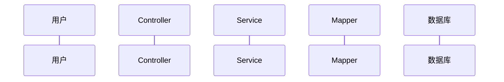

### 2.3 消息类型

| 语法 | 说明 | 使用场景 |
|------|------|----------|
| `A->>B` | 实线箭头（同步调用） | 方法调用、API 请求 |
| `A-->>B` | 虚线箭头（返回） | 返回结果、响应 |
| `A->>+B` | 激活参与者 | 开始处理 |
| `A-->>-B` | 停用参与者 | 处理结束 |
| `A-)B` | 异步消息 | 异步通知、事件 |

### 2.4 条件分支

使用 `alt`/`else` 表示条件分支：

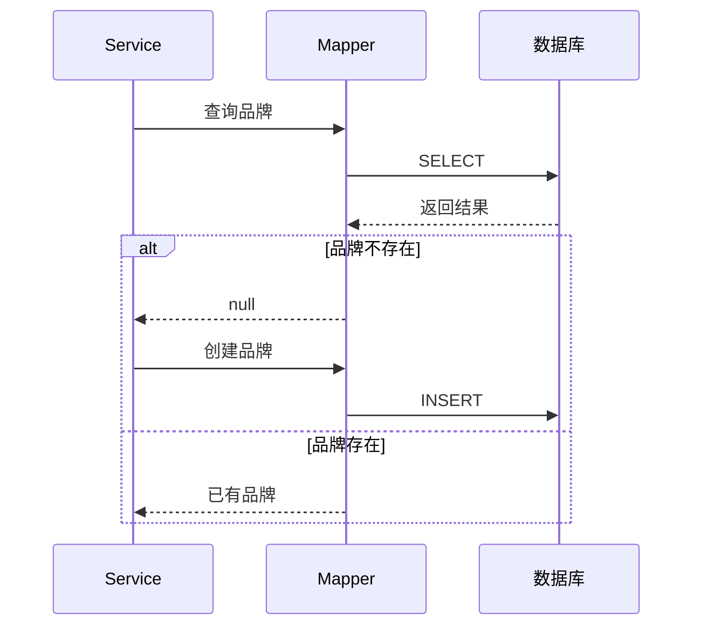

### 2.5 循环

使用 `loop` 表示循环：

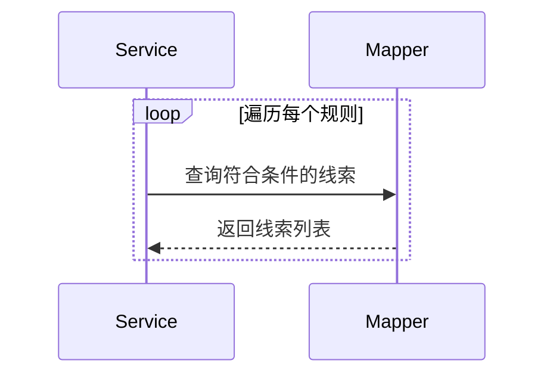

### 2.6 注释

使用 `Note` 添加注释说明：

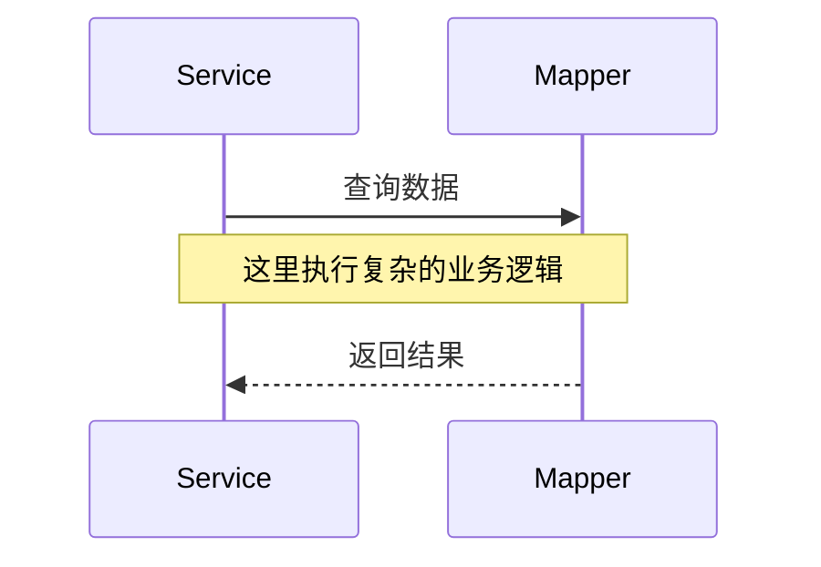

## 3. 业务流程示例

### 3.1 客户审批通过后自动创建/关联品牌

#### 流程图

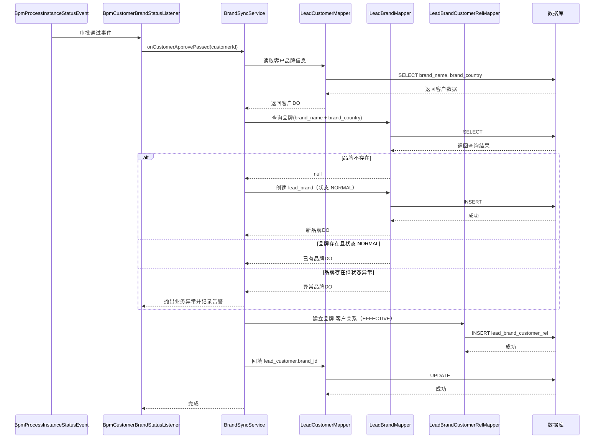

#### 流程说明

1. **审批事件触发**: 客户审批通过事件触发 `BrandSyncService.onCustomerApprovePassed`
2. **读取客户信息**: 从 `lead_customer` 表读取客户的品牌名称和国家信息
3. **查询品牌**: 以 `brand_name + brand_country` 查询品牌是否已存在
4. **创建或关联品牌**:
   - 若品牌不存在，则新建品牌，创建者取客户创建者，状态置 `NORMAL`
   - 若品牌存在且状态正常，则直接关联
   - 若品牌存在但状态异常，则拒绝关联并记录告警
5. **建立关系**: 在 `lead_brand_customer_rel` 表中建立品牌-客户关系，状态为 `EFFECTIVE`
6. **回填品牌ID**: 更新客户表的 `brand_id` 字段，保留原品牌快照字段

#### 异常处理

- **品牌状态非 NORMAL**: 拒绝自动关联并记录审计日志，避免脏数据
- **唯一键冲突**: 重试一次查询后转为关联路径（防并发双写）
- **任一数据库操作失败**: 事务回滚，确保数据一致性

### 3.2 客户品牌变更审批流程

#### 流程图

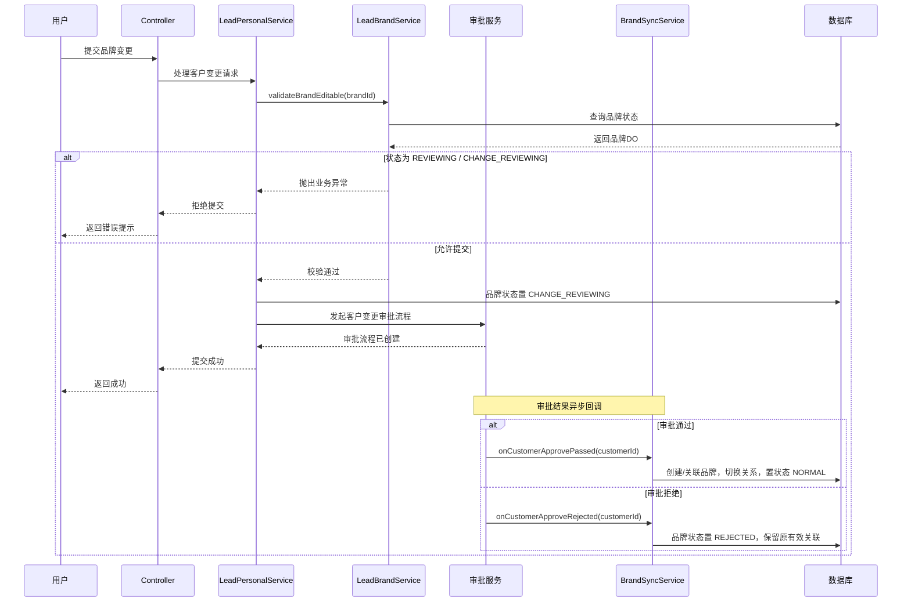

#### 流程说明

1. **提交变更**: 用户在客户编辑页面提交品牌字段变更
2. **品牌状态校验**: 先校验品牌当前是否可编辑（状态不能为 `REVIEWING` 或 `CHANGE_REVIEWING`）
3. **状态标记**: 进入审批后，目标品牌状态标记为 `CHANGE_REVIEWING`，期间前端禁改品牌字段
4. **发起审批**: 调用审批服务创建客户变更审批流程
5. **审批通过**: 按新品牌信息完成品牌创建/关联、关系切换、客户 `brand_id` 回填，品牌状态置 `NORMAL`
6. **审批拒绝**: 品牌状态置 `REJECTED`，保留原有效关联不变

#### 异常处理

- **变更目标与现有品牌一致**: 直接短路，无需审批
- **审批通过但目标品牌状态异常**: 记录错误并终止生效
- **关系切换失败**: 事务回滚，审批结果写告警队列人工处理

### 3.3 品牌列表查询流程

#### 流程图

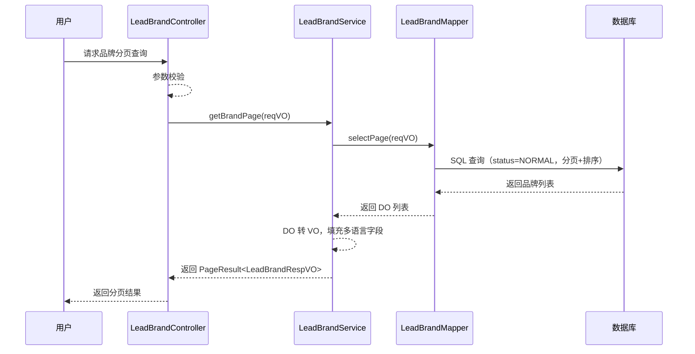

#### 流程说明

1. **接收请求**: 用户在品牌管理页面发起分页查询请求
2. **参数校验**: Controller 层校验请求参数（品牌名、业态、国家、创建人等筛选条件）
3. **查询数据**: Service 调用 Mapper 执行分页查询，仅查询状态为 `NORMAL` 的品牌
4. **数据转换**: 将 DO 转换为 VO，填充多语言字段（如品牌描述）
5. **返回结果**: 返回分页结果，包含品牌列表和分页信息

#### 异常处理

- **查询无数据**: 返回空列表，不抛错
- **品牌不存在或已删除**: 提示"品牌不存在或已失效"

### 3.4 查看品牌关联客户流程

#### 流程图

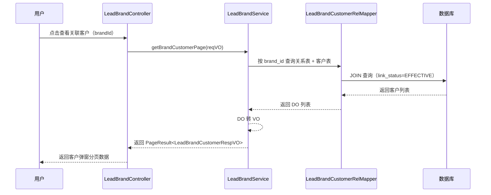

#### 流程说明

1. **触发查看**: 用户在品牌列表点击"查看关联客户"按钮
2. **查询关系**: Service 调用 RelMapper 查询品牌-客户关系表，JOIN 客户表获取客户信息
3. **过滤条件**: 仅查询关系状态为 `EFFECTIVE` 的有效关联
4. **数据转换**: 将 DO 转换为 VO，包含客户名称、归属人、归属组织、最后更新时间等
5. **返回结果**: 返回客户列表分页数据，支持客户名模糊检索

#### 异常处理

- **品牌不存在**: 提示"品牌不存在或已失效"
- **无关联客户**: 返回空列表

## 4. Flowchart 流程图（备选格式）

对于简单的流程或不涉及多系统交互的场景，可以使用 flowchart 格式：

### 4.1 基本语法

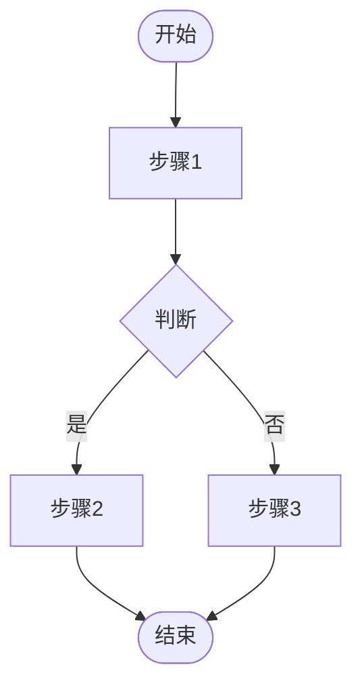

### 4.2 节点类型

| 语法 | 说明 | 示例 |
|------|------|------|
| `[文本]` | 矩形（普通步骤） | `A[开始]` |
| `{文本}` | 菱形（判断） | `B{是否通过}` |
| `([文本])` | 圆角矩形（开始/结束） | `([开始])` |
| `((文本))` | 圆形（连接点） | `((A))` |
| `[(文本)]` | 圆柱形（数据库） | `[(保存数据)]` |

### 4.3 连接线类型

| 语法 | 说明 |
|------|------|
| `-->` | 实线箭头 |
| `-.->` | 虚线箭头 |
| `==>` | 粗箭头 |
| `--文本-->` | 带文字的箭头 |

### 4.4 方向控制

| 语法 | 说明 |
|------|------|
| `TD` | 从上到下（默认） |
| `LR` | 从左到右 |
| `BT` | 从下到上 |
| `RL` | 从右到左 |

### 4.5 Flowchart 示例：待办创建流程

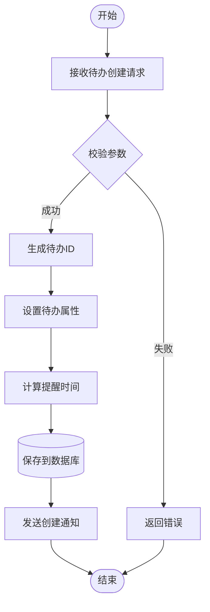

## 5. 状态机图（可选）

对于有明确状态流转的业务，可以使用状态机图：

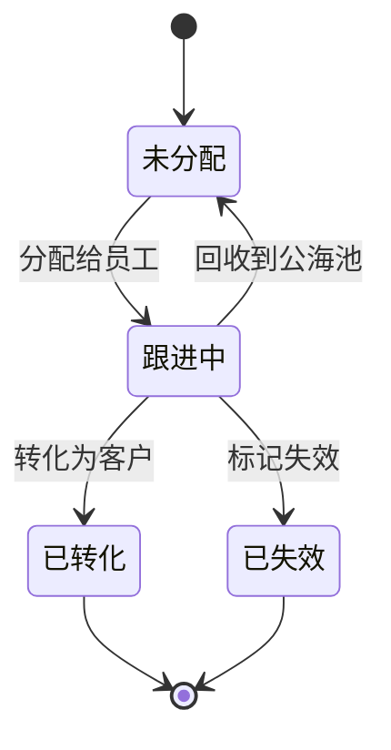

## 6. 流程描述规范

### 6.1 步骤描述格式

使用有序列表，每个步骤包含：
- **步骤名称**: 简短描述
- 详细说明: 具体操作内容

```markdown
1. **接收请求**: 接收前端传入的待办创建请求，包含线索ID、待办类型、计划时间等
2. **参数校验**: 校验必填字段、时间格式、线索是否存在等
```

### 6.2 异常处理格式

使用无序列表，每个异常包含：
- **异常名称**: 处理方式

```markdown
- **参数校验失败**: 返回 400 错误，提示具体校验失败原因
- **线索不存在**: 返回 404 错误，提示线索不存在
```

## 7. 流程文档模板

```markdown
### 5.1 [流程名称]

#### 流程图

​```mermaid
sequenceDiagram
    participant A as 参与者A
    participant B as 参与者B
    participant C as 参与者C

    A->>B: 操作1
    B->>C: 操作2
    C-->>B: 返回结果
    B-->>A: 返回结果
​```

#### 流程说明

1. **步骤1**: 详细说明
2. **步骤2**: 详细说明
3. **步骤3**: 详细说明

#### 异常处理

- **异常1**: 处理方式
- **异常2**: 处理方式

#### 注意事项

- 注意事项1
- 注意事项2
```

## 8. 流程设计原则

1. **清晰性**: 流程图应清晰易懂，避免过于复杂
2. **完整性**: 包含所有关键步骤和分支
3. **异常处理**: 明确说明各种异常情况的处理方式
4. **可追溯性**: 关键操作需要记录日志
5. **事务性**: 涉及多表操作时注意事务控制
6. **通知机制**: 重要操作需要通知相关人员

## 9. 图表选择指南

| 场景 | 推荐图表 | 说明 |
|------|----------|------|
| 系统组件交互 | 时序图（sequenceDiagram） | 清晰展示调用顺序和数据流转 |
| 审批流程 | 时序图（sequenceDiagram） | 展示审批各阶段的交互 |
| 数据查询流程 | 时序图（sequenceDiagram） | 展示查询链路和数据转换 |
| 简单业务流程 | Flowchart | 快速展示流程步骤 |
| 状态流转 | 状态机图（stateDiagram） | 展示状态变化规则 |
| 定时任务 | Flowchart | 展示任务执行逻辑 |
