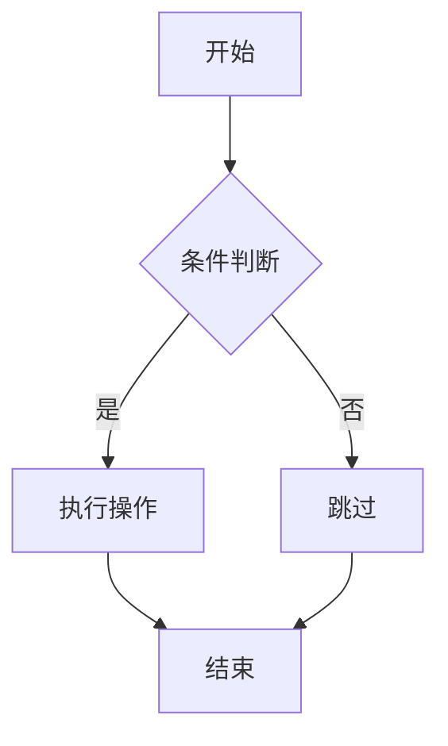
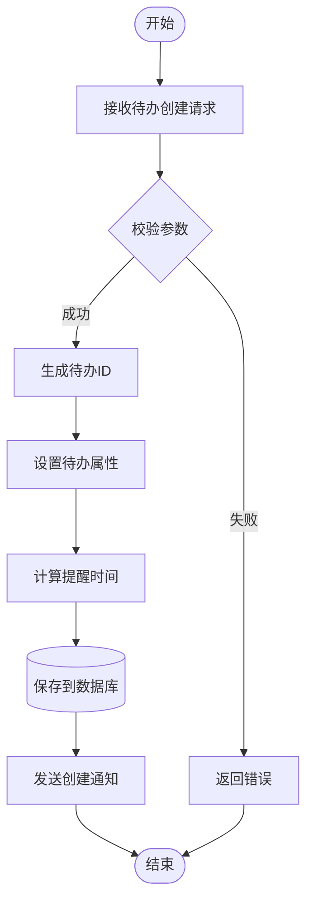
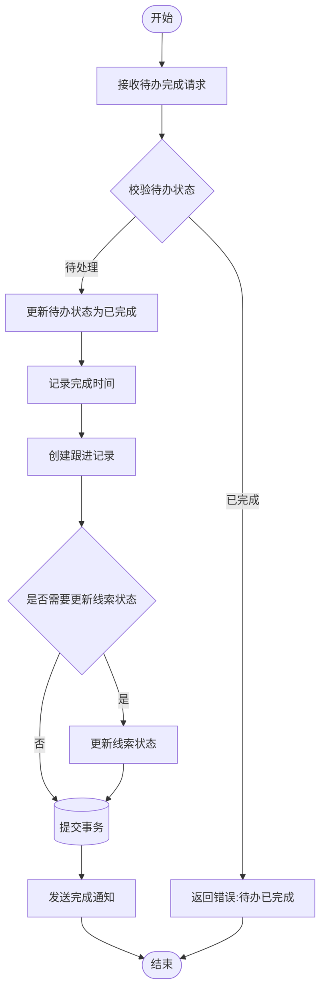
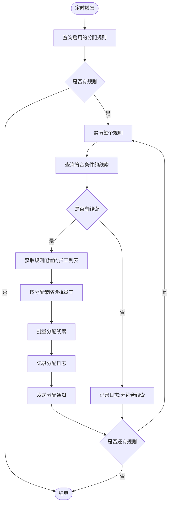
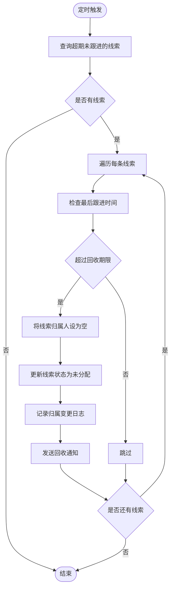
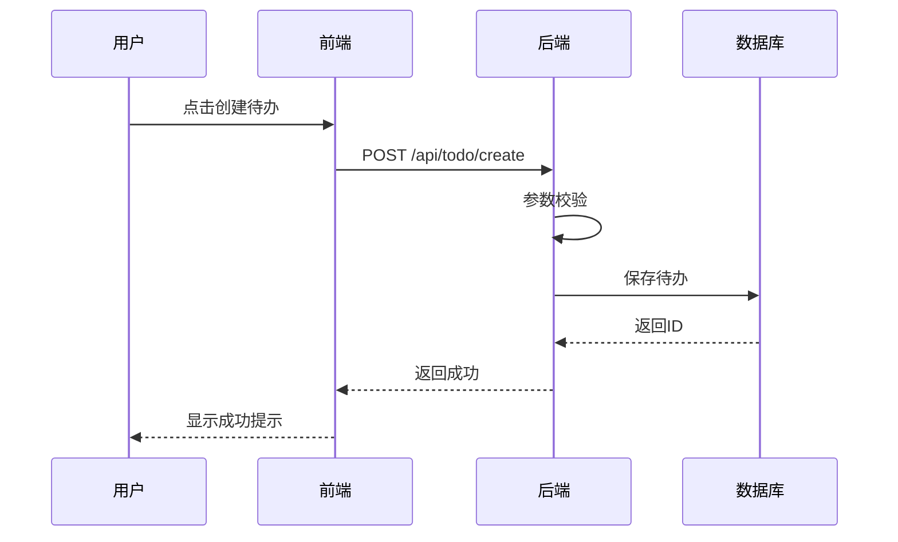
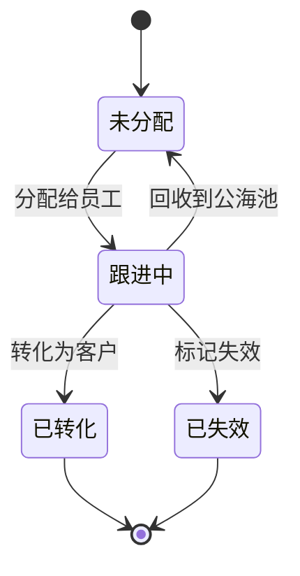

# 业务流程设计规范

本文档定义业务流程的设计规范、流程图绘制方法和描述格式。

## 1. 业务流程章节结构

```markdown
## 5. 核心业务流程

### 5.1 [流程1名称]

#### 流程图

​```mermaid
flowchart TD
    ...
​```

#### 流程说明

1. **步骤1**: 说明
2. **步骤2**: 说明
3. **步骤3**: 说明

#### 异常处理

- **异常1**: 处理方式
- **异常2**: 处理方式

### 5.2 [流程2名称]
...
```

## 2. Mermaid 流程图语法

### 2.1 基本语法



### 2.2 节点类型

| 语法 | 说明 | 示例 |
|------|------|------|
| `[文本]` | 矩形（普通步骤） | `A[开始]` |
| `{文本}` | 菱形（判断） | `B{是否通过}` |
| `([文本])` | 圆角矩形（开始/结束） | `([开始])` |
| `((文本))` | 圆形（连接点） | `((A))` |
| `[(文本)]` | 圆柱形（数据库） | `[(保存数据)]` |

### 2.3 连接线类型

| 语法 | 说明 |
|------|------|
| `-->` | 实线箭头 |
| `-.->` | 虚线箭头 |
| `==>` | 粗箭头 |
| `--文本-->` | 带文字的箭头 |

### 2.4 方向控制

| 语法 | 说明 |
|------|------|
| `TD` | 从上到下（默认） |
| `LR` | 从左到右 |
| `BT` | 从下到上 |
| `RL` | 从右到左 |

## 3. 业务流程示例

### 3.1 待办创建流程

#### 流程图



#### 流程说明

1. **接收请求**: 接收前端传入的待办创建请求，包含线索ID、待办类型、计划时间等
2. **参数校验**: 校验必填字段、时间格式、线索是否存在等
3. **生成ID**: 使用雪花算法生成待办唯一ID
4. **设置属性**: 设置待办状态为"待处理"，设置创建人、创建时间等
5. **计算提醒时间**: 根据计划时间计算提醒时间（提前15分钟）
6. **保存数据**: 将待办信息保存到 lead_todo 表
7. **发送通知**: 发送站内消息通知负责人

#### 异常处理

- **参数校验失败**: 返回 400 错误，提示具体校验失败原因
- **线索不存在**: 返回 404 错误，提示线索不存在
- **数据库保存失败**: 返回 500 错误，记录错误日志

### 3.2 待办完成（跟进）流程

#### 流程图



#### 流程说明

1. **接收请求**: 接收待办ID和跟进内容
2. **校验状态**: 检查待办是否已完成，避免重复操作
3. **更新待办**: 将待办状态更新为"已完成"，记录完成时间和完成人
4. **创建跟进记录**: 在 lead_follow_record 表中创建跟进记录
5. **更新线索状态**: 根据业务规则判断是否需要更新线索状态
6. **提交事务**: 确保待办更新和跟进记录创建的原子性
7. **发送通知**: 通知相关人员待办已完成

#### 异常处理

- **待办不存在**: 返回 404 错误
- **待办已完成**: 返回 400 错误，提示待办已完成
- **事务失败**: 回滚所有操作，返回 500 错误

### 3.3 自动分配执行流程（定时任务）

#### 流程图



#### 流程说明

1. **定时触发**: 每5分钟执行一次（可配置）
2. **查询规则**: 查询状态为"启用"的自动分配规则
3. **遍历规则**: 依次处理每个规则
4. **查询线索**: 根据规则条件（来源、地区等）查询未分配的线索
5. **选择员工**: 根据分配策略（轮询、随机、负载均衡）选择员工
6. **批量分配**: 将线索批量分配给选中的员工
7. **记录日志**: 在 lead_assign_log 表中记录分配详情
8. **发送通知**: 通知员工有新线索分配

#### 异常处理

- **规则配置错误**: 跳过该规则，记录错误日志
- **员工不存在**: 跳过该规则，记录错误日志
- **分配失败**: 回滚该规则的分配，记录错误日志，继续处理下一个规则

### 3.4 线索回收流程（定时任务）

#### 流程图



#### 流程说明

1. **定时触发**: 每天凌晨2点执行一次
2. **查询线索**: 查询已分配但超过N天未跟进的线索（N可配置）
3. **检查跟进时间**: 计算最后跟进时间距今的天数
4. **回收线索**: 将超期线索的归属人清空，状态改为"未分配"
5. **记录日志**: 在 lead_owner_change_log 表中记录归属变更
6. **发送通知**: 通知原负责人线索已被回收

#### 异常处理

- **线索状态异常**: 跳过该线索，记录警告日志
- **更新失败**: 跳过该线索，记录错误日志

## 4. 流程描述规范

### 4.1 步骤描述格式

使用有序列表，每个步骤包含：
- **步骤名称**: 简短描述
- 详细说明: 具体操作内容

```markdown
1. **接收请求**: 接收前端传入的待办创建请求，包含线索ID、待办类型、计划时间等
2. **参数校验**: 校验必填字段、时间格式、线索是否存在等
```

### 4.2 异常处理格式

使用无序列表，每个异常包含：
- **异常名称**: 处理方式

```markdown
- **参数校验失败**: 返回 400 错误，提示具体校验失败原因
- **线索不存在**: 返回 404 错误，提示线索不存在
```

## 5. 时序图（可选）

对于涉及多个系统交互的流程，可以使用时序图：



## 6. 状态机图（可选）

对于有明确状态流转的业务，可以使用状态机图：



## 7. 流程文档模板

```markdown
### 5.1 [流程名称]

#### 流程图

​```mermaid
flowchart TD
    A([开始]) --> B[步骤1]
    B --> C{判断}
    C -->|是| D[步骤2]
    C -->|否| E[步骤3]
    D --> F([结束])
    E --> F
​```

#### 流程说明

1. **步骤1**: 详细说明
2. **步骤2**: 详细说明
3. **步骤3**: 详细说明

#### 异常处理

- **异常1**: 处理方式
- **异常2**: 处理方式

#### 注意事项

- 注意事项1
- 注意事项2
```

## 8. 流程设计原则

1. **清晰性**: 流程图应清晰易懂，避免过于复杂
2. **完整性**: 包含所有关键步骤和分支
3. **异常处理**: 明确说明各种异常情况的处理方式
4. **可追溯性**: 关键操作需要记录日志
5. **事务性**: 涉及多表操作时注意事务控制
6. **通知机制**: 重要操作需要通知相关人员
