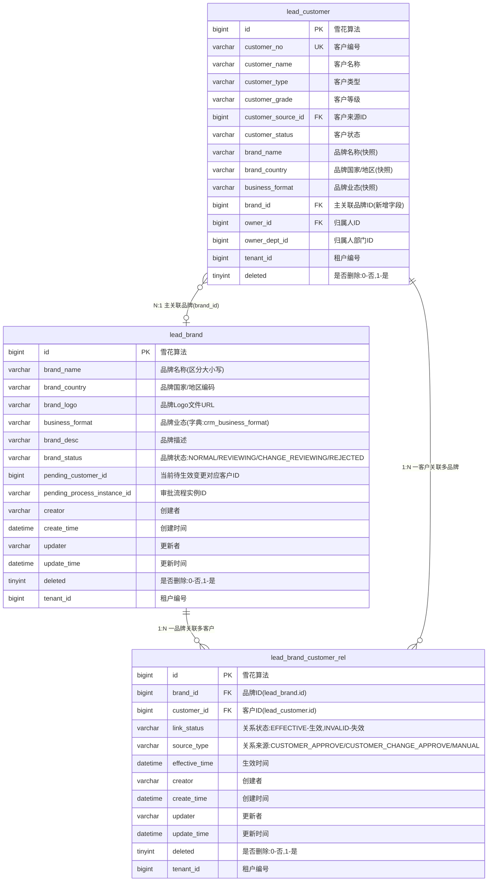

# 数据库设计规范

本文档定义数据库设计的标准格式、命名规范和示例。

## 1. 表清单格式

表清单必须使用表格形式，包含序号、表名、说明三列：

```markdown
| 序号 | 表名 | 说明 |
|------|------|------|
| 1 | user | 用户表 |
| 2 | order | 订单表 |
| 3 | order_item | 订单明细表 |
```

### 示例：线索管理系统表清单

| 序号 | 表名 | 说明 |
|------|------|------|
| 1 | lead_source | 线索来源表 |
| 2 | lead_main | 线索主表（公海池/个人线索） |
| 3 | lead_follow_record | 线索跟进记录表 |
| 4 | lead_modify_log | 线索修改记录表 |
| 5 | lead_assign_rule | 自动分配规则表 |
| 6 | lead_assign_rule_user | 规则员工关联表 |
| 7 | lead_todo | 待办管理表 |
| 8 | lead_customer | 客户表（线索转化后） |
| 9 | lead_assign_log | 分配执行日志表 |
| 10 | lead_owner_change_log | 线索归属变更记录表 |

## 2. ER 图规范

使用 Mermaid erDiagram 语法绘制 ER 图。

**重要：默认使用详细 ER 图格式**，包含完整的表结构、字段类型、约束和注释。

提供两种格式：

### 2.1 详细 ER 图（默认格式，推荐使用）

适用场景：详细设计文档、代码评审、数据库迁移、技术方案文档（默认）。

#### 字段定义语法

在表名后使用花括号定义字段：

```mermaid
erDiagram
    table_name {
        类型 字段名 约束 "字段说明"
    }
```

#### 约束标记说明

- `PK` : Primary Key（主键）
- `FK` : Foreign Key（外键）
- `UK` : Unique Key（唯一键）

#### 完整示例：品牌客户关系管理



#### 详细 ER 图绘制要点

1. **字段顺序**：
   - 主键字段放在最前面
   - 业务字段按重要性排列
   - 标准字段（creator, create_time, updater, update_time, deleted, tenant_id）放在最后

2. **字段类型**：
   - 使用 MySQL 数据类型：bigint, varchar, datetime, tinyint, text, decimal 等
   - 保持与建表 SQL 一致

3. **约束标记**：
   - 主键必须标记 `PK`
   - 外键必须标记 `FK` 并在注释中说明关联表
   - 唯一键标记 `UK`

4. **字段注释**：
   - 使用双引号包裹
   - 枚举值在注释中列出所有可能值
   - 外键注释格式：`"关联表说明(表名.字段名)"`
   - 字典字段注释格式：`"字段说明(字典:字典编码)"`

5. **关系定义**：
   - 在所有表定义之后统一定义关系
   - 关系描述格式：`"关系类型 关系说明"`
   - 示例：`"1:N 一品牌关联多客户"`

### 2.2 简化 ER 图（仅在特殊场景使用）

适用场景：技术方案初稿、架构讨论（仅在需要快速展示表关系时使用）。

#### 基本语法


#### 关系符号说明

- `||--||` : 一对一 (1:1)
- `||--o{` : 一对多 (1:N)
- `}o--o{` : 多对多 (N:M)

#### 示例


### 2.3 选择合适的 ER 图格式

| 场景 | 推荐格式 | 原因 |
|------|----------|------|
| 技术方案文档（默认） | 详细 ER 图 | 完整展示表结构，便于开发实现 |
| 详细设计文档 | 详细 ER 图 | 完整展示表结构，便于开发实现 |
| 代码评审文档 | 详细 ER 图 | 便于评审字段设计和约束 |
| 数据库迁移文档 | 详细 ER 图 | 需要完整的字段信息 |
| 技术方案初稿 | 简化 ER 图 | 快速展示表关系，便于讨论架构 |
| 系统架构文档 | 简化 ER 图 | 关注表关系，不需要字段细节 |

## 3. 表关系说明格式

使用表格形式说明表之间的关系：

```markdown
| 关系 | 说明 |
|------|------|
| user → order | 1:N，一个用户可以有多个订单 |
| order → order_item | 1:N，一个订单包含多个订单明细 |
```

### 示例

| 关系 | 说明 |
|------|------|
| lead_source → lead_main | 1:N，一个来源可对应多条线索 |
| lead_main → lead_follow_record | 1:N，一条线索可有多条跟进记录 |
| lead_main → lead_modify_log | 1:N，一条线索可有多条修改记录 |
| lead_main → lead_customer | 1:1，一条线索转化为一个客户 |
| lead_main → lead_todo | 1:N，一条线索可有多个待办 |

## 4. 建表 SQL 规范

### 文件头注释

```sql
-- =====================================================
-- [系统名称] - 数据库表设计
-- 版本: V1.0
-- 日期: 2024-01-01
-- 说明: 主键采用雪花算法生成，由应用层负责
-- =====================================================
SET NAMES utf8mb4;
SET FOREIGN_KEY_CHECKS = 0;
```

### 表结构规范

每个表必须包含以下标准字段：

```sql
CREATE TABLE `table_name` (
  `id` BIGINT NOT NULL COMMENT '主键ID(雪花算法)',

  -- 业务字段
  `field1` VARCHAR(100) NOT NULL COMMENT '字段说明',
  `field2` INT DEFAULT 0 COMMENT '字段说明',

  -- 标准字段（必须）
  `creator` VARCHAR(64) DEFAULT '' COMMENT '创建者',
  `create_time` DATETIME NOT NULL DEFAULT CURRENT_TIMESTAMP COMMENT '创建时间',
  `updater` VARCHAR(64) DEFAULT '' COMMENT '更新者',
  `update_time` DATETIME NOT NULL DEFAULT CURRENT_TIMESTAMP ON UPDATE CURRENT_TIMESTAMP COMMENT '更新时间',
  `deleted` TINYINT(1) NOT NULL DEFAULT 0 COMMENT '是否删除:0-否,1-是',
  `tenant_id` BIGINT NOT NULL DEFAULT 0 COMMENT '租户编号',

  PRIMARY KEY (`id`) USING BTREE,
  KEY `idx_create_time` (`create_time`) USING BTREE
) ENGINE=InnoDB DEFAULT CHARSET=utf8mb4 COLLATE=utf8mb4_unicode_ci COMMENT='表说明';
```

### 完整示例

```sql
-- ----------------------------
-- 线索来源表
-- ----------------------------
DROP TABLE IF EXISTS `lead_source`;
CREATE TABLE `lead_source` (
  `id` BIGINT NOT NULL COMMENT '主键ID(雪花算法)',
  `source_name` VARCHAR(50) NOT NULL COMMENT '来源名称(唯一)',
  `source_type` VARCHAR(32) NOT NULL COMMENT '来源类型:WEBSITE-官网,API-接口,FILE-文件,FORM-表单,MANUAL-手动,AI-AI抓取',
  `source_status` TINYINT(1) NOT NULL DEFAULT 1 COMMENT '状态:0-停用,1-启用',
  `is_public` TINYINT(1) NOT NULL DEFAULT 1 COMMENT '外部可见:0-否,1-是',
  `description` VARCHAR(200) DEFAULT NULL COMMENT '来源描述',
  `business_line` VARCHAR(32) NOT NULL DEFAULT 'ALL' COMMENT '业务线',
  `create_channel` VARCHAR(32) NOT NULL DEFAULT 'MANUAL' COMMENT '创建渠道:SYSTEM-系统内置,MANUAL-手动添加,API-接口导入',
  `creator` VARCHAR(64) DEFAULT '' COMMENT '创建者',
  `create_time` DATETIME NOT NULL DEFAULT CURRENT_TIMESTAMP COMMENT '创建时间',
  `updater` VARCHAR(64) DEFAULT '' COMMENT '更新者',
  `update_time` DATETIME NOT NULL DEFAULT CURRENT_TIMESTAMP ON UPDATE CURRENT_TIMESTAMP COMMENT '更新时间',
  `deleted` TINYINT(1) NOT NULL DEFAULT 0 COMMENT '是否删除:0-否,1-是',
  `tenant_id` BIGINT NOT NULL DEFAULT 0 COMMENT '租户编号',
  PRIMARY KEY (`id`) USING BTREE,
  UNIQUE KEY `uk_source_name_deleted` (`source_name`, `deleted`) USING BTREE
) ENGINE=InnoDB DEFAULT CHARSET=utf8mb4 COLLATE=utf8mb4_unicode_ci COMMENT='线索来源表';
```

## 5. 表结构详细说明格式

对于重要的表，需要提供详细的字段说明：

```markdown
### 表名（table_name）

**表说明**: 存储XXX的基本信息

| 字段名 | 类型 | 长度 | 是否必填 | 说明 | 约束 |
|--------|------|------|----------|------|------|
| id | BIGINT | - | 是 | 主键ID | 雪花算法，PRIMARY KEY |
| name | VARCHAR | 100 | 是 | 名称 | UNIQUE |
| status | TINYINT | 1 | 是 | 状态 | 0-停用，1-启用，默认1 |

**索引**:
- PRIMARY KEY (id)
- UNIQUE KEY uk_name (name)
- KEY idx_status (status)
```

## 6. 命名规范

### 表名规范

- 使用小写字母和下划线
- 使用复数形式或描述性名称
- 示例：`users`, `order_items`, `lead_main`

### 字段名规范

- 使用小写字母和下划线
- 布尔字段使用 `is_` 前缀
- 状态字段使用 `_status` 后缀
- 时间字段使用 `_time` 后缀
- 示例：`user_name`, `is_active`, `order_status`, `create_time`

### 索引命名规范

- 主键：`PRIMARY KEY`
- 唯一索引：`uk_字段名`
- 普通索引：`idx_字段名`
- 组合索引：`idx_字段1_字段2`

## 7. 数据类型选择

| 数据类型 | 使用场景 | 示例 |
|----------|----------|------|
| BIGINT | 主键、大数值 | id, user_id |
| INT | 普通数值 | age, count |
| TINYINT(1) | 布尔值、状态 | is_active, deleted |
| VARCHAR | 字符串 | name, email |
| TEXT | 长文本 | description, content |
| DATETIME | 日期时间 | create_time, update_time |
| DECIMAL | 金额 | price, amount |

## 8. 标准字段说明

所有表必须包含以下标准字段：

| 字段名 | 类型 | 说明 | 默认值 |
|--------|------|------|--------|
| id | BIGINT | 主键ID（雪花算法） | - |
| creator | VARCHAR(64) | 创建者 | '' |
| create_time | DATETIME | 创建时间 | CURRENT_TIMESTAMP |
| updater | VARCHAR(64) | 更新者 | '' |
| update_time | DATETIME | 更新时间 | CURRENT_TIMESTAMP ON UPDATE |
| deleted | TINYINT(1) | 逻辑删除标记 | 0 |
| tenant_id | BIGINT | 租户ID（多租户隔离） | 0 |

## 9. 枚举值定义

对于使用枚举的字段，需要在文档中说明枚举值：

```markdown
### 来源类型（SourceTypeEnum）

| 枚举值 | 说明 |
|--------|------|
| WEBSITE | 官网 |
| API | 接口 |
| FILE | 文件 |
| FORM | 表单 |
| MANUAL | 手动 |
| AI | AI抓取 |
```
