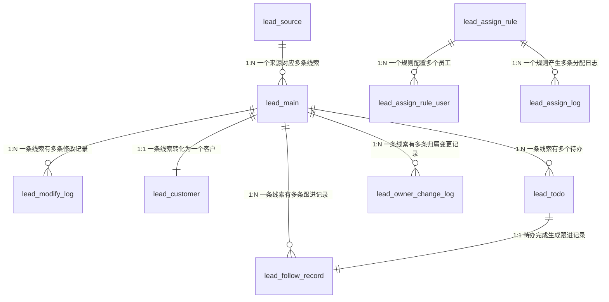
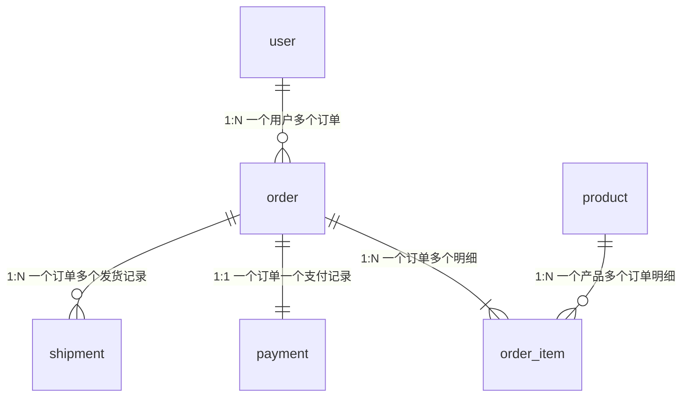
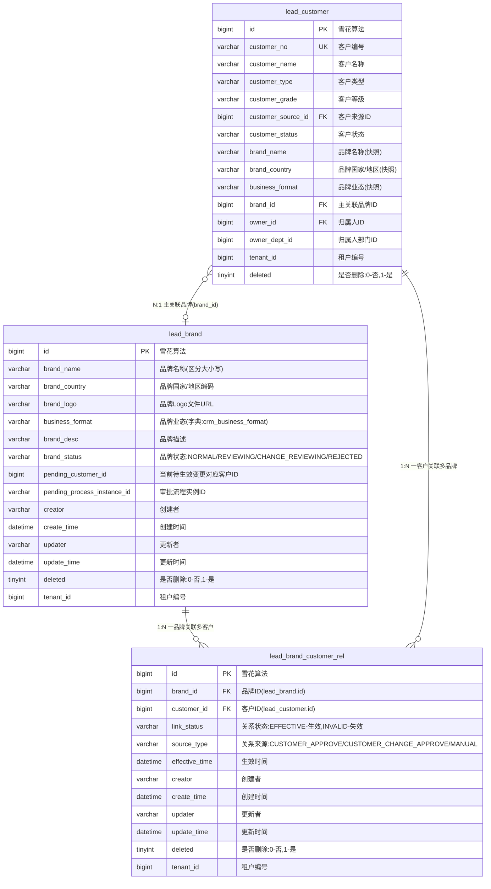
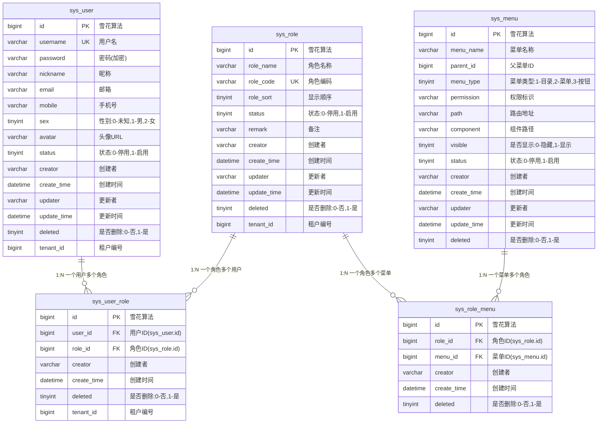
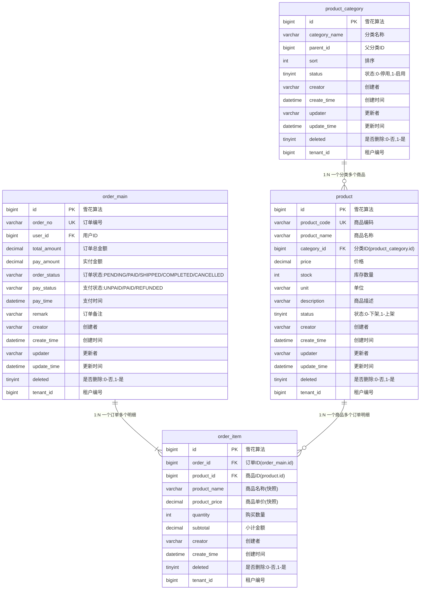

# ER 图示例集

本文档提供各种场景下的 ER 图示例，帮助快速生成标准化的数据库设计图。

## 1. 简化 ER 图示例

### 1.1 线索管理系统

### 1.2 订单管理系统

## 2. 详细 ER 图示例

### 2.1 品牌客户关系管理

### 2.2 用户权限管理

### 2.3 商品订单管理

## 3. 使用指南

### 3.1 选择合适的格式

**重要：技术文档默认使用详细格式**

| 场景 | 推荐格式 | 原因 |
|------|----------|------|
| 技术方案文档（默认） | 详细 ER 图 | 完整展示表结构，便于开发实现 |
| 详细设计文档 | 详细 ER 图 | 完整展示表结构，便于开发实现 |
| 代码评审文档 | 详细 ER 图 | 便于评审字段设计和约束 |
| 数据库迁移文档 | 详细 ER 图 | 需要完整的字段信息 |
| 技术方案初稿 | 简化 ER 图 | 快速展示表关系，便于讨论架构 |
| 系统架构文档 | 简化 ER 图 | 关注表关系，不需要字段细节 |

### 3.2 详细 ER 图绘制规范

1. **字段顺序**：
   - 主键字段（id）放在最前面
   - 唯一键字段紧随其后
   - 业务字段按重要性排列
   - 标准字段放在最后（creator, create_time, updater, update_time, deleted, tenant_id）

2. **字段类型**：
   - 使用 MySQL 数据类型：bigint, varchar, datetime, tinyint, text, decimal, int
   - 保持与建表 SQL 一致

3. **约束标记**：
   - 主键必须标记 `PK`
   - 外键必须标记 `FK` 并在注释中说明关联表
   - 唯一键标记 `UK`

4. **字段注释规范**：
   - 使用双引号包裹
   - 枚举值格式：`"字段说明:值1/值2/值3"` 或 `"字段说明:值1-说明1,值2-说明2"`
   - 外键格式：`"关联表说明(表名.字段名)"`
   - 字典字段格式：`"字段说明(字典:字典编码)"`
   - 快照字段格式：`"字段说明(快照)"`

5. **关系定义**：
   - 在所有表定义之后统一定义关系
   - 关系描述格式：`"关系类型 关系说明"`
   - 示例：`"1:N 一品牌关联多客户"`

### 3.3 常见关系类型

| 关系符号 | 含义 | 示例 |
|----------|------|------|
| `\|\|--\|\|` | 一对一 (1:1) | 订单 → 支付记录 |
| `\|\|--o{` | 一对多 (1:N) | 用户 → 订单 |
| `}o--o{` | 多对多 (N:M) | 学生 ↔ 课程 |
| `}o--o\|` | 多对一 (N:1) | 订单 → 用户 |

### 3.4 标准字段说明

所有表必须包含以下标准字段（在详细 ER 图中必须展示）：

| 字段名 | 类型 | 说明 |
|--------|------|------|
| id | bigint | 主键ID（雪花算法） |
| creator | varchar | 创建者 |
| create_time | datetime | 创建时间 |
| updater | varchar | 更新者 |
| update_time | datetime | 更新时间 |
| deleted | tinyint | 逻辑删除标记:0-否,1-是 |
| tenant_id | bigint | 租户编号 |

